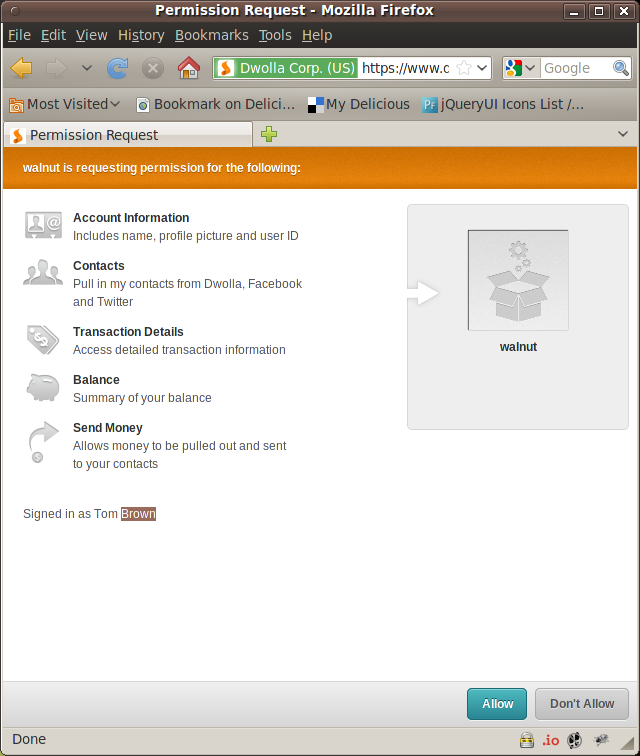
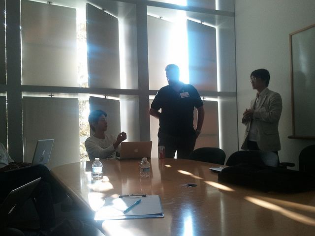

!SLIDE bullets
# Dwolla OAuth2
* [1. Get a Token](https://www.dwolla.com/developers/authentication)
* [2. Use a Token](https://www.dwolla.com/developers/endpoints/transactions/send)

!SLIDE center

!SLIDE center
# [@nov](https://twitter.com/nov)

!SLIDE center
## Bearer Example Project
* [rack-oauth2](https://github.com/nov/rack-oauth2-sample)

!SLIDE center
## Mailing List
* [rack-oauth2](https://groups.google.com/forum/?fromgroups#!forum/rack-oauth2)

!SLIDE bullets
# OAuth 2 Security 
* [OAuth 2 Threat Model and Security Considerations](http://tools.ietf.org/html/draft-ietf-oauth-v2-threatmodel-06)

!SLIDE bullets incremental
# OAuth 2 MAC
* [draft-ietf-oauth-v2-http-mac-00](http://tools.ietf.org/html/draft-ietf-oauth-v2-http-mac-00)
* [rack-oauth2-sample-mac](https://github.com/nov/rack-oauth2-sample-mac)

